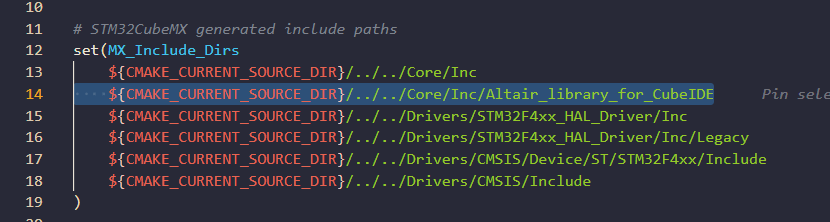

# Altair_library_for_CubeIDE

STM32CubeIDE (CMake プロジェクト) 向けライブラリです。

## 含まれるライブラリ

| ファイル | 概要 |
|---|---|
| `can_lib` | CAN 通信 |
| `encoder` | エンコーダ |
| `kinematics` | 運動学 |
| `motor_driver` | モータドライバ |
| `pid` | PID 制御 |
| `serial_lib` | シリアル通信 |

## 導入手順

### 1. リポジトリをダウンロード

[https://github.com/Altairu/Altair_library](https://github.com/Altairu/Altair_library) よりダウンロードします。


### 2. フォルダをコピー

`Altair_library_for_CubeIDE` フォルダを選択してコピーします。


### 3. プロジェクトに配置

STM32CubeIDE プロジェクトの `Core/Inc` 内に貼り付けます。

```
Core/
└── Inc/
    └── Altair_library_for_CubeIDE/   ← ここに配置
        ├── altair.h
        ├── can_lib.h / can_lib.c
        ├── encoder.h / encoder.c
        ├── kinematics.h / kinematics.c
        ├── motor_driver.h / motor_driver.c
        ├── pid.h / pid.c
        └── serial_lib.h / serial_lib.c
```


### 4. CMakeLists.txt を編集

`CMakeLists.txt` に以下を追記します。

```cmake
# STM32CubeMX generated include paths
set(MX_Include_Dirs
    ${CMAKE_CURRENT_SOURCE_DIR}/../../Core/Inc
    ${CMAKE_CURRENT_SOURCE_DIR}/../../Core/Inc/Altair_library_for_CubeIDE
    ${CMAKE_CURRENT_SOURCE_DIR}/../../Drivers/STM32F4xx_HAL_Driver/Inc
    ${CMAKE_CURRENT_SOURCE_DIR}/../../Drivers/STM32F4xx_HAL_Driver/Inc/Legacy
    ${CMAKE_CURRENT_SOURCE_DIR}/../../Drivers/CMSIS/Device/ST/STM32F4xx/Include
    ${CMAKE_CURRENT_SOURCE_DIR}/../../Drivers/CMSIS/Include
)

# STM32CubeMX generated application sources
set(MX_Application_Src
    ${CMAKE_CURRENT_SOURCE_DIR}/../../Core/Src/main.c
    ${CMAKE_CURRENT_SOURCE_DIR}/../../Core/Src/stm32f4xx_it.c
    ${CMAKE_CURRENT_SOURCE_DIR}/../../Core/Src/stm32f4xx_hal_msp.c
    ${CMAKE_CURRENT_SOURCE_DIR}/../../Core/Src/sysmem.c
    ${CMAKE_CURRENT_SOURCE_DIR}/../../Core/Src/syscalls.c
    ${CMAKE_CURRENT_SOURCE_DIR}/../../startup_stm32f446xx.s
    ${CMAKE_CURRENT_SOURCE_DIR}/../../Core/Inc/Altair_library_for_CubeIDE/can_lib.c
    ${CMAKE_CURRENT_SOURCE_DIR}/../../Core/Inc/Altair_library_for_CubeIDE/encoder.c
    ${CMAKE_CURRENT_SOURCE_DIR}/../../Core/Inc/Altair_library_for_CubeIDE/kinematics.c
    ${CMAKE_CURRENT_SOURCE_DIR}/../../Core/Inc/Altair_library_for_CubeIDE/motor_driver.c
    ${CMAKE_CURRENT_SOURCE_DIR}/../../Core/Inc/Altair_library_for_CubeIDE/pid.c
    ${CMAKE_CURRENT_SOURCE_DIR}/../../Core/Inc/Altair_library_for_CubeIDE/serial_lib.c
)
```




### 5. main.c にインクルード

`main.c` の先頭に以下を追加するだけで全ライブラリが使用可能になります。

```c
#include "Altair_library_for_CubeIDE/altair.h"
```
