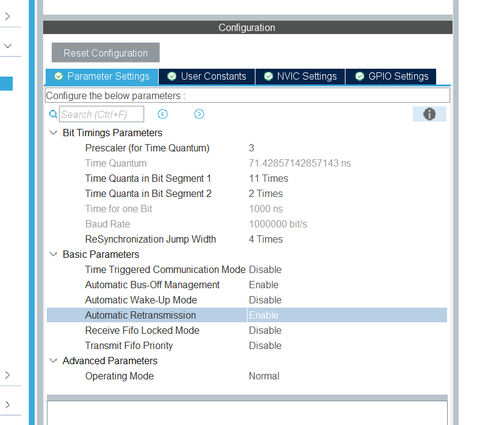
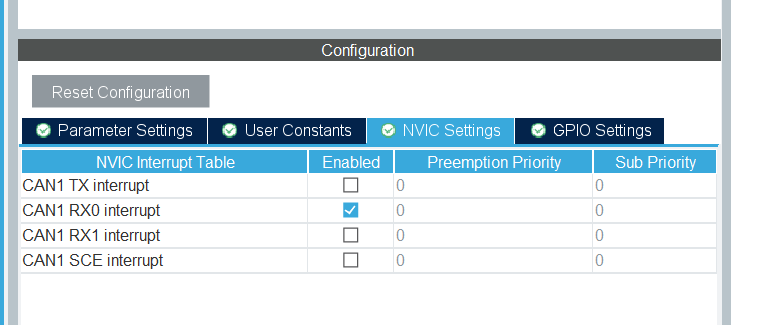
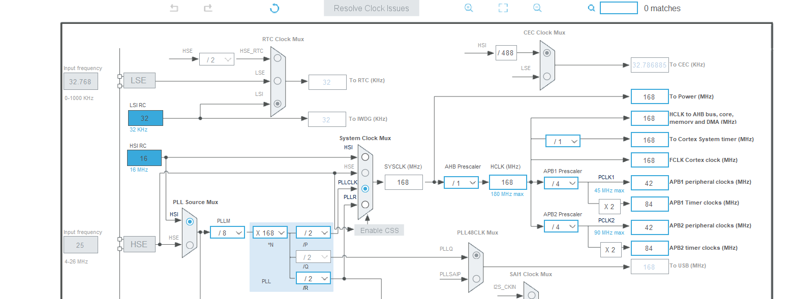

# can_lib 使い方

CAN送受信をシンプルに扱えるライブラリ。  
メールボックスの空き待ちなどの面倒な処理はライブラリ内部で完結している。

この版では **CAN1/CAN2を同時に別用途で使用可能**。

---

## CubeMX 必須設定

以下の3つは **CubeMX (MX_CAN1_Init) 側で設定する**こと。ライブラリでは触れない。

| パラメータ | 推奨値 | 理由 |
|---|---|---|
| `AutoRetransmission` | `ENABLE` | エラー時に自動再送。フレームが黙って捨てられなくなる |
| `AutoBusOff` | `ENABLE` | Bus-Off 状態からハードウェアが自動復帰する |
| `SyncJumpWidth` | `CAN_SJW_2TQ` | ノード間のクロックずれを吸収する再同期幅 |

CubeMXで設定後、生成されたコードが自動的に適用される。
以下のように設定する







---


## ボーレートの確認

ボーレート = APB1クロック ÷ (Prescaler × (1 + TimeSeg1 + TimeSeg2))

デフォルト設定例（HSI 168MHz、APB1 = 42MHz）:
- Prescaler=2, BS1=16TQ, BS2=4TQ, SJW=2TQ → **1Mbps**

相手ノードのボーレートと一致していること。

---

## 使い方

### 初期化

```c
#include "Altair_library_for_CubeIDE/can_lib.h"

// MX_CAN1_Init() の後に呼ぶ
Can_Init(&hcan1, NULL);  // デフォルト設定
```

CAN1/CAN2を同時に使う場合:

```c
#include "Altair_library_for_CubeIDE/can_lib.h"

CanInitConfig can1_cfg = Can_DefaultInitConfig(&hcan1);
CanInitConfig can2_cfg = Can_DefaultInitConfig(&hcan2);

// 必要ならFIFOやFilterBankを用途別に調整
// can1_cfg.filter_bank = 0;
// can2_cfg.filter_bank = 14;

Can_Init(&hcan1, &can1_cfg);
Can_Init(&hcan2, &can2_cfg);
```

### 送信

```c
uint8_t data[8] = {1, 2, 3, 4, 5, 6, 7, 8};
Can_Transmit(&hcan1, 0x125, data, 8);
```

- メールボックスが満杯な場合は内部で最大 `CAN_TX_TIMEOUT_MS`(デフォルト10ms) 待機する
- タイムアウトした場合は `HAL_TIMEOUT` を返す（無視してもよい）

### 受信

受信は割り込みで自動処理され、リングバッファのキューに積まれる。`CAN_RX_QUEUE_SIZE` は32で、32スロット確保して最大31フレーム保持する。メインループで `Can_Receive` を使って取り出す。

```c
extern CanRxQueue g_can1_rx_queue;
extern CanRxQueue g_can2_rx_queue;

CanRxData rx;

// キューが空になるまで取り出す
while (Can_Receive(&g_can1_rx_queue, &rx)) {
    uint32_t id  = rx.std_id;
    uint8_t  dlc = rx.dlc;
    // rx.data[0] ～ [dlc-1] にデータが入っている
}
```

キューが満杯のときに届いたフレームは破棄され、`overflow_count` が加算される。

## デュアルCAN運用の注意

- `SlaveStartFilterBank` でCAN1/CAN2のフィルタバンク領域を分割する
- デフォルトでは `SlaveStartFilterBank=14`、CAN1はBank0、CAN2はBank14を使う
- CubeMX側のCAN設定（特にビットタイミング・AutoRetransmission・AutoBusOff）は従来通り必須

---

## タイムアウト時間の変更

`can_lib.h` の先頭にある定義を変更する。

```c
#define CAN_TX_TIMEOUT_MS  10   // 任意の値に変更可
```
